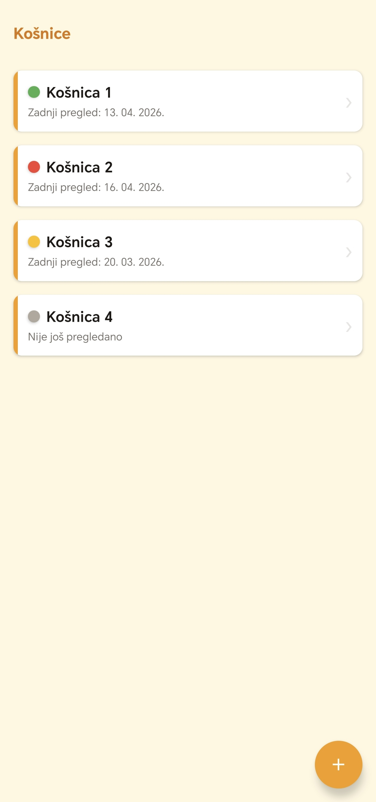
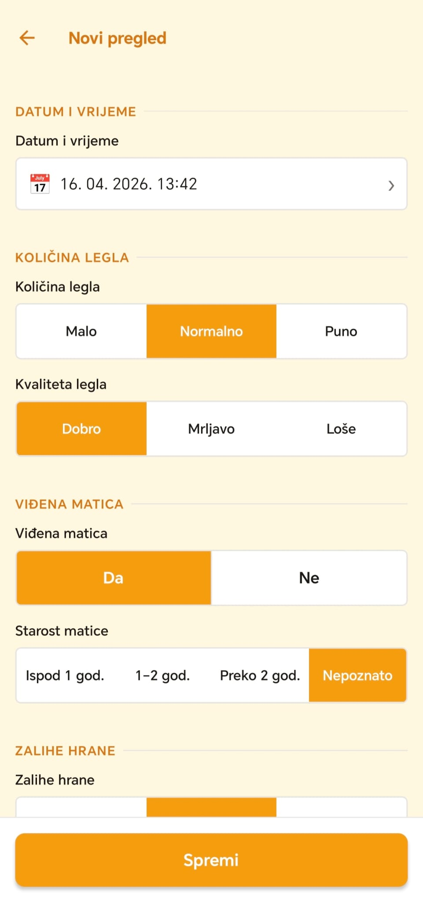
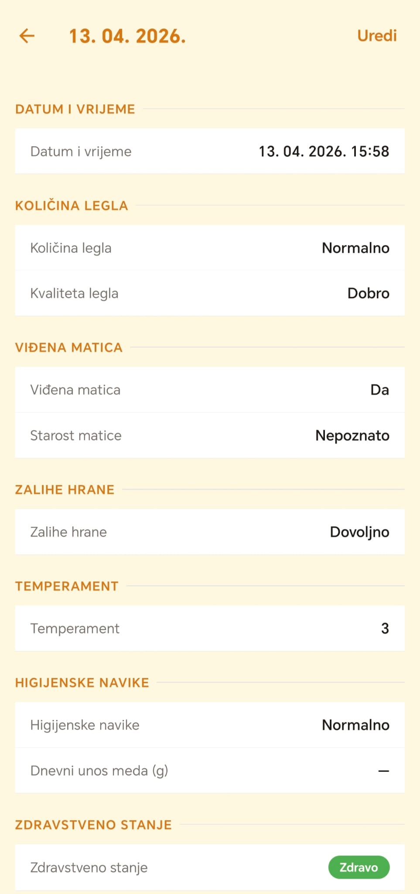
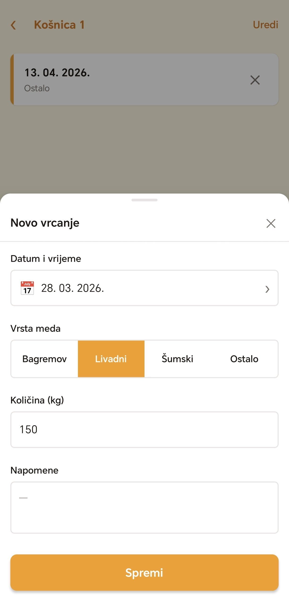

# Pčelar 

A mobile application for beekeepers to manage their hives and track 
all beekeeping activities. Built for Android as a real client project.

## Features

- **Hive management** — Add and track multiple hives with location notes
- **Inspection logging** — Structured inspection forms covering brood 
  quantity and quality, queen status and age, food stores, temperament, 
  hygienic behavior, honey intake, and health status
- **Health & treatments** — Log diseases and treatments with substance 
  name and date
- **Equipment condition** — Track wooden component condition for floor, 
  supers, frames, feeder, and roof
- **Swarm events** — Record natural swarms and artificial splits with 
  destination hive
- **Honey harvest logs** — Track extraction date, honey type, and quantity
- **Feeding logs** — Record food type and quantity added to each hive
- **Reminders** — Set local push notifications for hive tasks
- **Offline-first** — All data stored locally on device, no internet required
- **Croatian language UI** — Built entirely in Croatian for local client use

## Tech Stack

- **React Native + Expo** (TypeScript, Expo Router v3)
- **expo-sqlite** — Local SQLite database, offline-first
- **Zustand** — Lightweight state management
- **expo-notifications** — Local push notifications for reminders
- **No backend** — Fully standalone, all data on device

## Screenshots

<table>
  <tr>
    <td align="center">
      
      <br/>
      <sub>Popis košnica</sub>
    </td>
    <td align="center">
      
      <br/>
      <sub>Novi pregled</sub>
    </td>
  </tr>
  <tr>
    <td align="center">
      
      <br/>
      <sub>Detalji pregleda</sub>
    </td>
    <td align="center">
      
      <br/>
      <sub>Vrcanje meda</sub>
    </td>
  </tr>
</table>

## Project Context

Built as a real-world client project for a beekeeper in Croatia. 
Designed for field use — large tap targets, button-based inputs, 
minimal keyboard interaction, and high contrast for outdoor readability.

## Development

```bash
# Install dependencies
npm install

# Start development server (requires Expo Go on device)
.\start.ps1

# Build release APK
.\build.ps1
```

## Requirements

- Node.js 18+
- Android SDK (set ANDROID_HOME in build.ps1)
- Java JDK 17
- Android device or emulator

## License

Private client project — not licensed for redistribution.